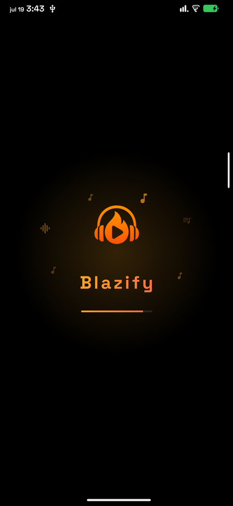
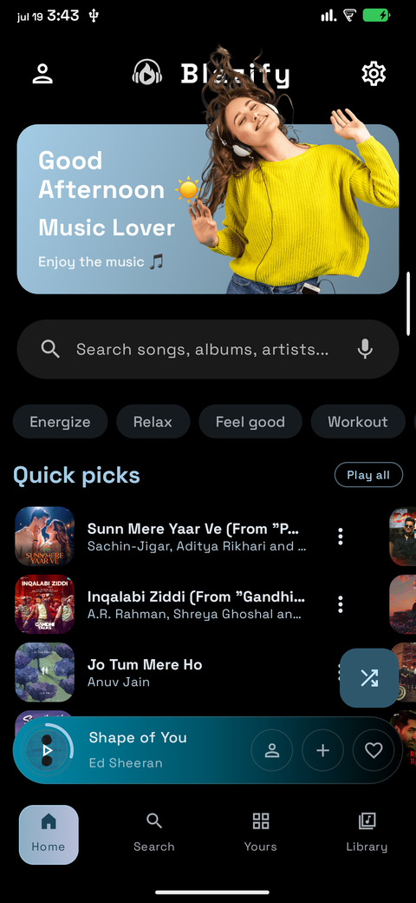
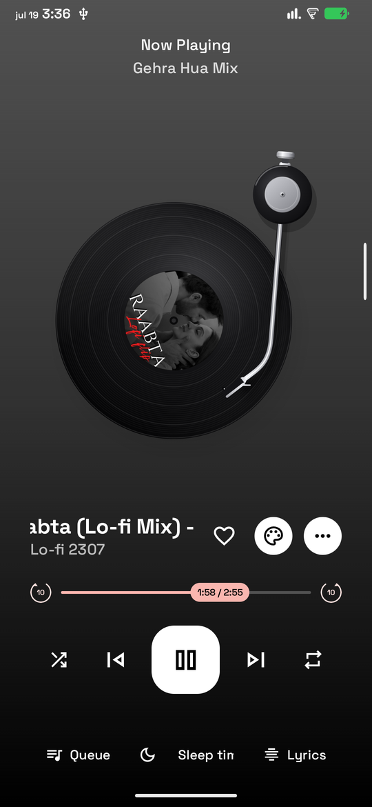
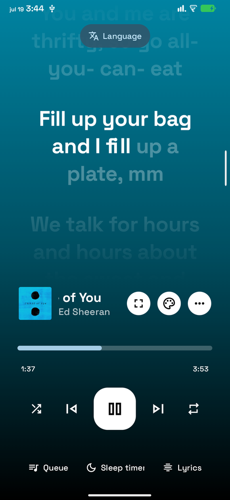
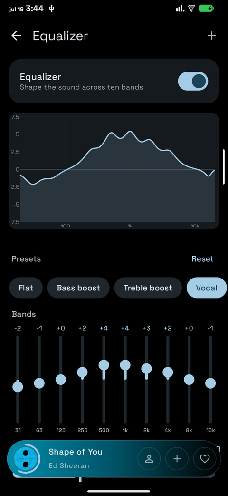
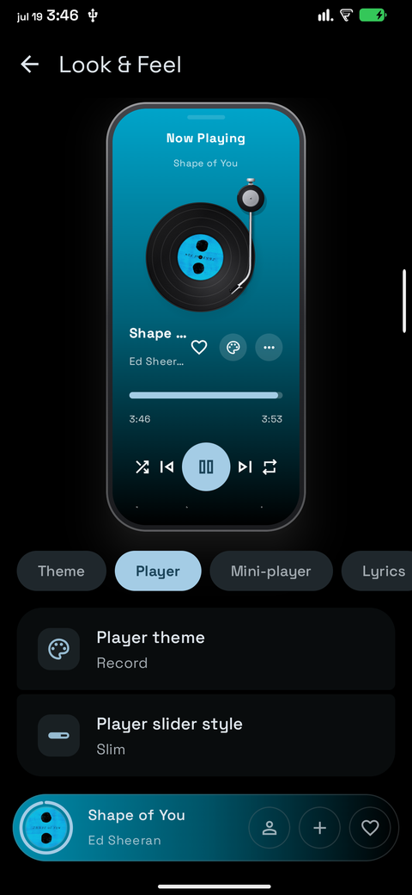

# Blazify 🔥

**A modern music streaming player for Android — Kotlin, Jetpack Compose, Material 3.**

*Stream it. Feel it. Blaze it.*

---

| | | |
|:---:|:---:|:---:|
|  |  |  |
| **Splash** | **Home** | **Player** |
|  |  |  |
| **Synced lyrics** | **Equalizer** | **Look & Feel** |

---

## Overview

Blazify streams from a vast online catalogue, plays gapless with Media3/ExoPlayer,
shows word-by-word synced lyrics, and lets you restyle almost every surface of the
app — with a live preview while you do it. No ads, no tracking.

---

## Features

### 🎵 Playback

| Feature | What it does |
|---|---|
| **Streaming** | Millions of songs, albums, artists, playlists and podcasts |
| **Gapless audio** | Media3/ExoPlayer with selectable audio quality |
| **Radio & autoplay** | Keeps the music going with related tracks after the queue ends |
| **Offline downloads** | Save anything for listening without a connection |
| **Queue control** | Drag to reorder, swipe to remove, shuffle, repeat one/all |
| **Audio tools** | Volume normalisation, tempo and pitch control, skip-silence |
| **Sleep timer** | Live countdown, plus an end-of-song mode |
| **Song recognition** | Identify whatever is playing around you |

### 🎚️ Sound

| Feature | What it does |
|---|---|
| **10-band equalizer** | Drag each band, with a live frequency-response curve above |
| **13 presets** | Rock · Pop · Jazz · Classical · Hip-hop · Electronic · Acoustic · Vocal · Bass boost · Treble boost · Loudness · Podcast · Flat |
| **Preamp** | Each preset pre-compensated so boosts never clip |
| **Extra effects** | Bass boost, surround and reverb layered on the parametric EQ |
| **AutoEQ** | Import a profile, or run the wizard to fetch one for your headphones |
| **Output switching** | Move audio to speaker, wired, USB or Bluetooth from the player |

### 🎨 Look & Feel

| Feature | What it does |
|---|---|
| **Live preview hub** | Five tabs — Theme, Player, Mini-player, Lyrics, Home — previewed in a phone frame |
| **Dynamic theming** | Colours follow your album art, automatically |
| **Custom colours** | Or pick your own: saturation/value field, hue rail, hex entry |
| **Pure black** | True black dark mode for OLED panels |
| **5 player layouts** | Classic · Ring · Full art · Record · Cassette |
| **4 seek-bar styles** | Capsule · Wavy · Slim · Squiggly |
| **Navigation styles** | Four nav-bar looks, plus a configurable home header |

### 📖 Lyrics

| Feature | What it does |
|---|---|
| **Synced lyrics** | Word-by-word highlighting from multiple providers |
| **Provider priority** | Choose which sources are tried, and in what order |
| **Translation** | Read along in your own language |
| **Romanization** | Sing along to any script |
| **Styling** | Size, spacing, alignment, glow and animation |

### 👥 Social & library

| Feature | What it does |
|---|---|
| **Listen Together** | Share a room code and play in sync with friends |
| **Playlist import** | Bring playlists in from a file or a link |
| **last.fm** | Scrobble what you play |
| **Android Auto** | Full in-car playback |
| **Widgets** | Home-screen controls |

---

## Install

Download the latest APK from **[Releases](https://github.com/rajendra7169/blazify/releases/latest)**.

Requires **Android 8.0 (API 26)** or newer.

> Signed with the project's own release key. If you have an earlier build that
> came from a different key, uninstall it before installing this one.

---

## Libraries & Integrations

| Project | Contribution |
|---|---|
| **Better Lyrics** | Time-synced lyrics with word-by-word highlighting & YouTube Music integration |
| **LRCLIB · KuGou** | Additional synced-lyrics sources |
| **metroserver** | Listen-together real-time backend |
| **MusicRecognizer** | Music recognition feature & Shazam API integration |
| **BlazifyExtractor** | YouTube cipher deobfuscation and PoToken generation |
| **last.fm** | Scrobbling and listening history |

## Tech

| | |
|---|---|
| Language | Kotlin |
| UI | Jetpack Compose, Material 3 |
| Playback | Media3 / ExoPlayer |
| DI | Hilt |
| Database | Room |
| Images | Coil |
| Async | Coroutines + Flow |

---

## Disclaimer

This project is not affiliated with, funded, authorized, endorsed by, or in any
way associated with YouTube, Google LLC, or any of their affiliates and
subsidiaries.

All trademarks, service marks, and intellectual property rights referenced in
this project belong to their respective owners.

---

## Support ☕

If Blazify made your day a little better, you can buy me a coffee.

**Scan to support Blazify**

---

## License

Released under the **[GNU General Public License v3.0](LICENSE)** — see [NOTICE](NOTICE).

If you distribute this app or a build of it, GPL-3.0 asks you to pass on the
same freedoms: keep the licence, keep the notices, and make the source available.

---

Made with ❤️ by **Rajendra Pandey**

