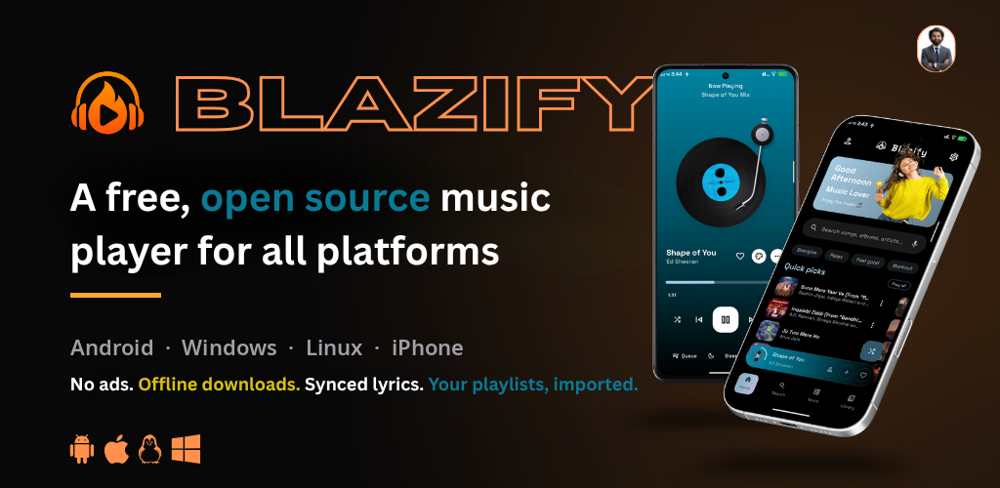
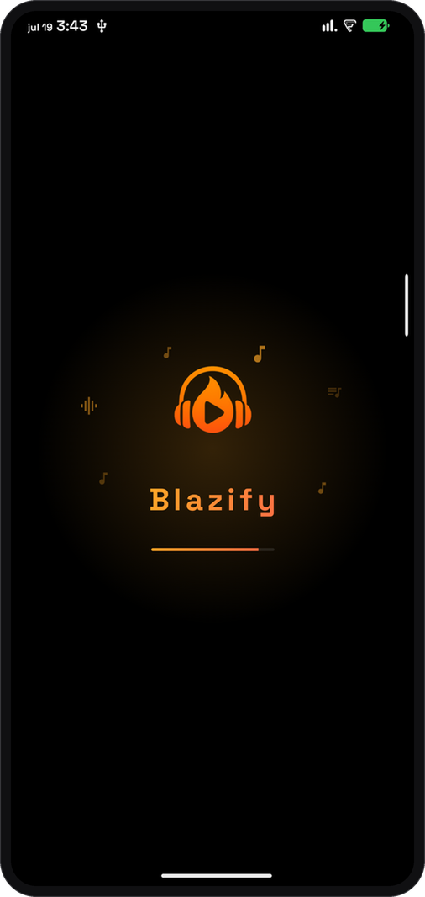
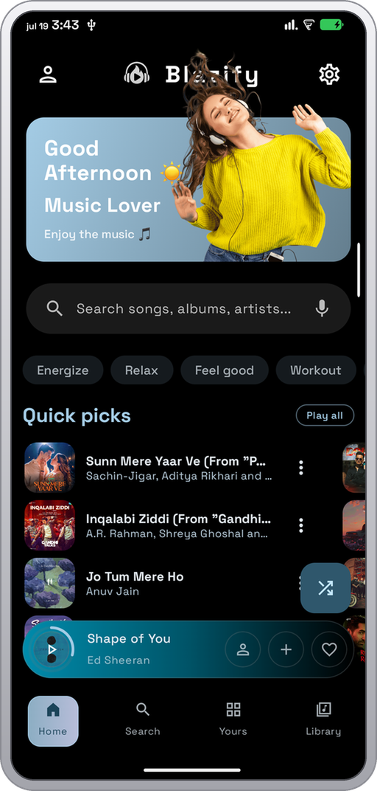
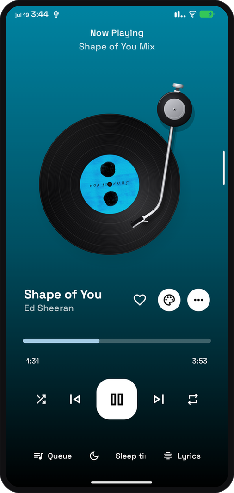
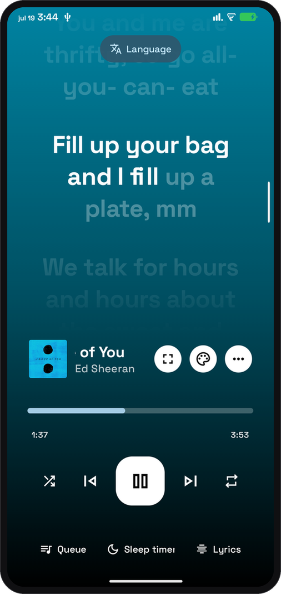
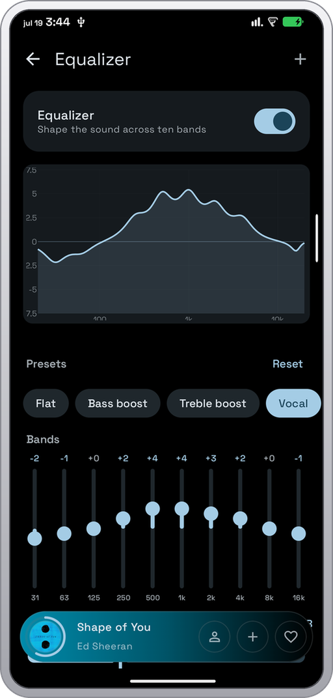
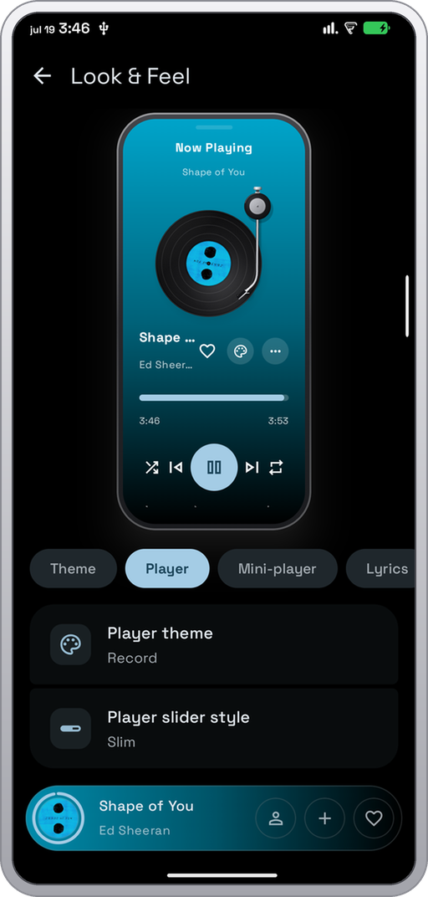

# Blazify 🎧🔥

**A free, open-source music player. No ads, no tracking, no account needed.**

*Stream it. Feel it. Blaze it.*

**Download it now** -- one click, straight from the newest release.

   

**Official website: [rajendra7169.github.io/blazify](https://rajendra7169.github.io/blazify/)** · screenshots, features and downloads for every platform

---

| | | |
|:---:|:---:|:---:|
|  |  |  |
| **Splash** | **Home** | **Player** |
|  |  |  |
| **Synced lyrics** | **Equalizer** | **Look & Feel** |

---

## Overview

**Blazify is a free, open-source music player with no advertisements, no tracking,
and no account required.** It is an alternative to Spotify and YouTube Music that
plays any song you choose rather than shuffling, downloads for offline listening
without a subscription, and keeps playing with the screen off.

It streams from a vast online catalogue, shows word-by-word synced lyrics, has a
ten-band equalizer, and lets you restyle almost every surface of the app with a
live preview while you do it. Signing in with Google is optional and brings your
own YouTube Music library and playlists.

Available for **Android, Windows, Linux and iPhone**. Built with Kotlin and
Jetpack Compose, gapless through Media3/ExoPlayer.

---

## Blazify everywhere else

The same player, built natively for each platform. The buttons at the top of
this page download any of them — these are the repos.

**Android** — [rajendra7169/blazify](https://github.com/rajendra7169/blazify) *(you are here)* 
**Windows & Linux** — [rajendra7169/blazify-desktop](https://github.com/rajendra7169/blazify-desktop) 
**iPhone** — [rajendra7169/blazify-ios](https://github.com/rajendra7169/blazify-ios)

Screenshots, install guides and everything else: **[blazify website](https://rajendra7169.github.io/blazify/)**

---

## Features

### 🎵 Playback

| Feature | What it does |
|---|---|
| **Streaming** | Millions of songs, albums, artists, playlists and podcasts |
| **Gapless audio** | Media3/ExoPlayer with selectable audio quality |
| **Radio & autoplay** | Keeps the music going with related tracks after the queue ends |
| **Offline downloads** | Save anything for listening without a connection |
| **Queue control** | Drag to reorder, swipe to remove, shuffle, repeat one/all |
| **Audio tools** | Volume normalisation, tempo and pitch control, skip-silence |
| **Sleep timer** | Live countdown, plus an end-of-song mode |
| **Song recognition** | Identify whatever is playing around you |

### 🎚️ Sound

| Feature | What it does |
|---|---|
| **10-band equalizer** | Drag each band, with a live frequency-response curve above |
| **13 presets** | Rock · Pop · Jazz · Classical · Hip-hop · Electronic · Acoustic · Vocal · Bass boost · Treble boost · Loudness · Podcast · Flat |
| **Preamp** | Each preset pre-compensated so boosts never clip |
| **Extra effects** | Bass boost, surround and reverb layered on the parametric EQ |
| **AutoEQ** | Import a profile, or run the wizard to fetch one for your headphones |
| **Output switching** | Move audio to speaker, wired, USB or Bluetooth from the player |

### 🎨 Look & Feel

| Feature | What it does |
|---|---|
| **Live preview hub** | Five tabs (Theme, Player, Mini-player, Lyrics, Home) previewed in a phone frame |
| **Dynamic theming** | Colours follow your album art, automatically |
| **Custom colours** | Or pick your own: saturation/value field, hue rail, hex entry |
| **Pure black** | True black dark mode for OLED panels |
| **5 player layouts** | Classic · Ring · Full art · Record · Cassette |
| **4 seek-bar styles** | Capsule · Wavy · Slim · Squiggly |
| **Navigation styles** | Four nav-bar looks, plus a configurable home header |

### 📖 Lyrics

| Feature | What it does |
|---|---|
| **Synced lyrics** | Word-by-word highlighting from multiple providers |
| **Provider priority** | Choose which sources are tried, and in what order |
| **Translation** | Read along in your own language |
| **Romanization** | Sing along to any script |
| **Styling** | Size, spacing, alignment, glow and animation |

### 👥 Social & library

| Feature | What it does |
|---|---|
| **Listen Together** | Share a room code and play in sync with friends |
| **Playlist import** | Bring playlists in from a file or a link |
| **last.fm** | Scrobble what you play |
| **Android Auto** | Full in-car playback |
| **Widgets** | Home-screen controls |
| **Backup & restore** | Your whole library in one file: songs, playlists, history, sign-in |
| **In-app updates** | Tells you when a new version is out, downloads it, and installs it |

---

## Roadmap

What is planned, what has been asked for, and what is deliberately not being done: **[ROADMAP.md](ROADMAP.md)**. Local music on Android shipped in 9.13.2.

---

## Install

Download the latest APK from **[Releases](https://github.com/rajendra7169/blazify/releases/latest)**.

Requires **Android 8.0 (API 26)** or newer. New install? Just open the APK, nothing else to do.

### Automatic updates with Obtainium

[Obtainium](https://github.com/ImranR98/Obtainium) watches this repository and
installs each new release for you.

Tap that on your phone, or add `https://github.com/rajendra7169/blazify` in
Obtainium by hand. Blazify updates itself too — this is for people who prefer
one app managing everything they sideload.

### Also on app stores

GitHub Releases above is the official source and always has the newest
version first. The same app is also listed here:

[![Get it on APKPure](https://img.shields.io/badge/Get_it_on-APKPure-FFA726?style=for-the-badge&logo=data:image/png;base64,iVBORw0KGgoAAAANSUhEUgAAABwAAAAcCAYAAAByDd%2BUAAAFxElEQVR42s2WX4xVVxXGv7X3Puf%2Bmf8dm7HaKMbaxJlBCwRLjKFGnzSWtLZnYoLWFA3W0Gk1DsUHm8vVGiqMGCE1qX0gxAfTe3VMyqT6oBZCCjQWE0eZIKROnUJAOgPMzP13zj57fz7cmcLIMExjYtzJyXnY56zv%2FNa3z1oL%2BB8vWXaXFECw7mSh25quDb7aICEiWlGZQFxlpnrq04XDALhSQbXcZlQuKwiYJPnvm87WQ7o1Nxp05A%2BZlswos5lDPW1Tf9xy%2BJMbQEhUivRKBM3N6QqqjMh%2F%2FPiuVV7rL9tLVx08SVAgCjqZcT2dk0Ha2vkUBA%2F2spf%2FFWGEPoEInVdP6pZsG50HACOA9tS6C2%2BFQVonQ33%2F5le%2FsL4oRb8SyqUFCwVVxoBffeLZO0XrR30tpiw8KwqBq%2BA9wQUQmianNULZAQC90a0plxbsGxcISKee0G3ZDp86DxEREM5rdvIc8mEMD61sxVJnsemrRx9YtxJKtRQdorJf9%2Fozd4iRr7taTBElAOGhGEpdbjcXQGUgoID0OqsDl7VPrYTyBsFoZ59AwDjJbNNtuS6mzgNUoHidD8XPVg7mVP20ygQk4CGibNVSMvLgV17dtKaIIpejVDd6F%2Fn%2B3%2F%2BwB4LHfC1hM5OkGCW%2BWpsbGwuGNM0LOiMiJAEIPL3J64CB3w4Bl6NcJBj1NU8m8sFjpiPX7W3qASgCXuUzklQaBzFUnJL4vb9IrtiLKtSKYJOyklJl8NAjxx%2F62HJequurSjka8Otf298tWr55PZ0yWqcz1Url0oV9USnSBzYeeJuJ%2BpnJaRHiGmWLDmnieS%2FLXFbwvsM7NQSM2diqW3M9i%2BhyGbCWvHB%2B8%2FNnfzVQdgCwulLfZ68m51WoNQgComw19Qjl4UeO3t9XFCxJaRbojgCu91j7baQb9HXbpAMoWms7W61djM%2BP4vWtH6COVSYO5LvM175oJ0c62%2FxgktBDRNPRB20qkzTSpwF8aSkvVbOqlBVEqOG%2Fptvzd3hr5%2BkomoLp9O1wuqv%2Bkjh3Gokej4WnINV%2F%2FJZdW%2BYqhFLQ10dOtNE3r6WklAF%2F14mfttPHT%2FhGskAHJQo2TTAtVw0ygaG%2F1mAEQB0GZ5M81mZnkVKolEhc93auFv4AAMbL4zd0I9X0Tpjz8RbTkb%2FTJwveEQoKl91lWGOBFITj4st7%2Fp15VJyBBr1pDZStYeR3G389FpUiXY5KnqRELGmQUmBBCUjpPfVci6rU%2F6pD80Efp4Q0U%2B2d4xn%2FBmzoAMqSzZQQrMEc1mRnWVfGNWq59b%2B5tzQGudYjB9%2Fc0ytQaxXkDwYiDE7s3ixtLavS2aoTEU0QRgymMS02k0KUQfMf%2F48ONn8%2FbXPsb7UKl%2B3IyL0vjn3jZKfJTXy0hWHcjkY2FsMQLrHnX%2FvQJbPh2I9vq9INSZJQ0PROoJg6K1N%2BugKATL1AblI8CNSVkb%2FNZhobZs7uEBECsNvO7dc6sc%2FQ2DxSJMbqHeWBAWdsaFtp9e2SNk8ESWfasro%2BNfPLJIy3Q2U1AnGLRGK3OL8qlTfnOvGpux%2B958l%2F%2BvUepLDuoFQO8H0UtW%2FvR4beanoIoP%2F47r2mo%2BXb6UzVitYa9Dae%2FNcnzkTDY%2B9mMBqcHC639LQ%2F3LhSBaSZL1tL%2FhQE6vN73zc0DbD546tE9rtKY6uI5HQ%2BVPGlKyNnouGx%2B14pmCOH4W8luHEn1BEUnUy479WmKp9zqcsE2UBsw%2F5FlGzb%2B%2F6hqWufNl9%2BVh979vl7xp9j%2F4nd9Q%2B%2FtH1t8wgW1EqnsYUyNjjxo4Pfmdrnv3XxJ3x8YvgBACi8UnhndlKFqEQQYhDsYergavHoG5v2%2FLngqSBFv1LB3vk4Qah3eU9J6%2FZk96q50YglXfxMMb2xywPoP7rr53e%2F%2FPRnQci7oXsnzPw7j0%2FsLg9ODm8BgIglvbTvpNz18mAGvMVwvOzg3Iyz7dz%2B7sLEgSz%2BH9a%2FAfeFCoEpHmB5AAAAAElFTkSuQmCC)](https://apkpure.com/blazify/com.blazify.music) [![Get it on Appteka](https://img.shields.io/badge/Get_it_on-Appteka-FFA726?style=for-the-badge&logo=data:image/png;base64,iVBORw0KGgoAAAANSUhEUgAAABwAAAAcCAYAAAByDd%2BUAAAGxUlEQVR42oWWbZCWZRXHf%2Bdc9%2FO2ECy2QhYIrrxFICVOMQXGiwgtgqTJEM0k1BBgBRZl2mRLNaFmjU2NFTGONjiG7Aw1hIzkCLECYcOLk7zKLhAbrC4BC8vuPs%2F93Nd1%2BvDs4gILXp%2FuL%2Ff5Xed%2FznXOX%2BjuVKP8hAAweDW9cm18DpGxiIwTkxEmUiGGIHZasAMWbEcI9s%2BWPDv%2B8x2ar4zR9ci1YGNWkopF54EsFpGRLkOKAObBOsKIgjhAwRcogu3HZGVbe%2FJ83VIK3UEvB67FMRs%2F8g%2Fc4Zw%2B4bJ6l3kICVjAiyAd%2F3T%2BZ4CZYaI4jYAIfFvYkvjw6IHF%2FKsz5tXATtizzNKcW%2BUiqQgFEkAxBOlGjctPCQ7BpYmCt7MW%2BwX%2FXsS6rlC9JONs%2FMiVbpbLutUqUuHb8aX7ot3BRAQVV7pJ6VsEUYEo5PEqcgORW33bSnc%2Fs%2FFUl1jSqfNtv%2BNTknavi5M%2BVsQjuGuloqLEPqaQQNpBMEgMyiJFNcJKRQ7iUPPWEop%2B4tsPsZtqVKqr0ZpPEKWadaPL6mSf%2F2BYaxwzsPxmpg%2F9MoP6DKPoY%2FY07uDvdTW0F9vJRCmCGRheszifD1vb2sPUuiXEbutWrO9dOj8q06U%2Bj5drwARBRWkvxky%2BtYpnptYw8eYZ5DI9GdRnGLNunc%2Foj32G3Y1v0Jw%2Fh1MHoCHBu5zcEsHJ9%2B6wXTL6ecotdltcVkaHGLtU1yuOE8eFQoEvDJnJL6f8mRMt9ayofZij5%2FbjxDHhlhk8%2Btlfs7dpOw9tmEnRFxARgKApxBftgFz041zfKiaquG%2BbEV3rbao4LsYF7hn2RZ6c%2FCJ1Z%2FexbNMc9jTuJvFttBZb2Nmwm4tJE1%2F5%2BFL%2B21rP3sY95KIUhmGGiEl5omGnqnNjNUvaAv5asNa4wNTBM%2Fn5xD%2FR0FLPstfmUH%2FuCL2zGZxGpKIMH8ooW46t5934OLffNA6nEErNIxbwmiXtnNypwWwcAeSq1i%2FV7EKhQNXQ%2B3h6ykvUN%2B9nycb7ONF8nB7pDD74jgxKwySYp%2BDzRC6NSpfqC0IAVMaqmIwwf7WUKkJ7MaZq6ExWTHqBhvN1LNs0lxPnj1KWypJ431kjVBz5JDCgfDD9c5U0NNcR%2B1JHl%2BYBEjxgMlQNqei4oFzZ%2BpMqp%2FP05DUcP3%2BIha9M53RrE89MW8PXxnyfQpJgBpE62uI8lX0G8fidz3Km0MT6Q6vJOOmUtBS7pO6Ho%2B7av%2BCL3Fw%2BkB%2BN%2Fy0nW4%2Fy8Ktz%2BV%2FrGX5x93NMGXg%2FEwbOIAlF%2FrjrKfKJ0b9Xf566ezWVvUfwyOtzOdZ8lLJUx1u8Inwk2BlR6WcBK00sJU6M6UPn0C83gAf%2FNoGG88f4TdUaJgyYwQU7iyNi8e2Pk4Qim46s41dTX2L4DZ%2FksS1f5dUjf6Esle6aHYCJIiHYmciwA%2BI6gSJmgbSDyj7DOdZ6iKaLJ3lyynNMGnAvLdaMkwjDKFLk62N%2BwAMjFnBj2Uf54T%2Fmsf5QDT3T6e4yM3GIBjusIrYdBTMMDKE0G2Mf08P1ZPmklUyrfICLdh4Vd0n2osWkJEVF7iZ%2BvGUB6w%2B%2BTM9MpiOzy4FmpcDB5E21YDt8gaIoDjARJTF4q3E7%2FbL9Gd1vLHlrQ%2BT9ARQskJY0IQSWb13I%2BkMv0yOdIQTf7doSxYWYOARfq3h2EuygRqV95s1TlnJsqlvHzvc2kyFLwAjmCebxlpCRDEnw%2FKz2m%2Fz14JoOGf0196RGmJnVaWCba3qFfN97JWhaZoQiQQRVceR9O3sbtzPkxpFU9hxOWrKkJENOenC6vZEV25aw4XANPdJp7OqadZUzaBoNwZa%2FvdDekOpq9IVBpHsnutFldGLoWE8qpeeRi3JMHzqXUf0%2BTaSOUxca2PDOi9SfradH%2BqpuvNIDeMngQhxqyy6EaTu%2FS%2F7SAh61ijEibrM66WVFAoKKCCF42pJASkEF8glkHGSiD4QFSaEhsbbg%2Fef3LWIX1ahjK0Y12rSMUxVV%2Bo4K96iTTMcwVxUlE6Vw6nCi5KIUqnpdGQl4TeHMrC0Ubf6%2BxfZaZ2JXmahRv%2BdLLu1WSSTlIe4wUZc7teuaKCBoyURd8IlfsO8brO1qot7f7jUYa3FN89j%2Fkam2GWOIy0mlCGKGYPguyMtsIkZAUU0hkkZ9PtRaHB7ct4hNV9rEy%2B1ETUnedx%2FhZDTB1qZNTwVskJiUa5YUighI57sWRSRCNIWGhGLwdpii%2FDSF%2F95bizlGNcq3rmeEu7H6lSvp3dMznkjGg4wFGQZSUVo6dkbhcLDwpgSrbT7HthOPce56Vv%2F%2F3VhKISZf3W8AAAAASUVORK5CYII%3D)](https://appteka.store/app/b16r317210) [![Also at blazify.apk.com](https://img.shields.io/badge/Also_at-blazify.apk.com-FFA726?style=for-the-badge&logo=data:image/png;base64,iVBORw0KGgoAAAANSUhEUgAAABwAAAAcCAYAAAByDd%2BUAAAGJUlEQVR42mWWy49cVxHGf3VuP6d7xp3BtsYxjp84tgfjByP8wsmWWGLHhn%2FAKIqyZGUhKxJZsYwiK7BmxRYJIUUIpCATKyAZg7CDZWwHx%2FE4M9OP6ec9VcXi3n4Ni6Puc%2B89p76v6vvqHMERBL%2F%2B2fXi%2Fu8uXAsWrqtxWZ1d7og5qAtuYAbq4C6YZ3NzMBfMwPP3ZuLm3lST20b81fEDi799T96LOCIAN%2F3dpYTCDTfeISS1mBru2Wbqkv23cYAsmBrgOQDNn%2BXBffxehBjpqvJhSXvv%2F%2Fr4B2256TdLIbZ%2BXigUfzpSdTXcjWDIDIN8WM50wson7DIQMgFqDqqYuwjFRNJ%2B%2FEWf%2Fs8KRbpvaQhvp2qq6uJIMGYYMcPMmKA3d9wkez8OauBMU%2B1IMHezkZmLvF2l8kkhml8nhHocmrsEmbAaL8qZTVi4U%2FIy6sLAh7iHmXTPfD%2FNSlAzJynUNeUnwdQvxZG5CaJj9Hnx1SQb%2BWJMGJlypXKR75cuMIhx%2Bm0Ocvz9NBOCexBNzaOFSwVzGgYyi2qMclIPy4INXdktu7lauUhw4dPOXV74FokXMfM59Y7Xzqhb3LwRzBHPg%2FkE2TS45oudgJpzubzGctjF3sI3eLN2gUzRMl%2FHiah2CA%2BRYLOe0oyZziDLgAT6OuK15Jucq5xGRVFRLtTOcjgcoBdH4GGaWhfiDEtzyQRmELK8Tz2nMwbOTYyqI55wsXKO5UKDng3Y1j57isu8UV8jaEDNJhvrjJo1n4%2F1EaaSl3lzWzYwoW8pxwqHWC0dJ7WUvg3pWo8hI84vnuRE8TDdnOWcymdTms%2BDzXYRm%2FeUmZC6UaHKWvksS8kSHe3hOOZOM3ZoFJa4sniWqlUYqWb1tJ3WmM7DHOUdKTWHoSrHioc5VTlKz%2FtEjOeDr3k2eMnQIm3rcWbxOCfLhxjEFHOZdBy1aYca2yZMbcCMucFNSFWpS52L1TNUQ4WO9hlZyscv7%2FDx5qcMLaWVdqiEEld3nWHRaww14jnwSQucaSTTlOZNdxxcHaLDydJRXi8doRW3MTcedr%2Fg8fBLnsSXPOz%2Fl4ixEducqh3mdPUIUT3vscykdxo8qO1Akc%2BjG0tS58rCeRBh2%2Fp0dcCd5j9JCiWKocyd9r%2FoxD4d7aMYVxvfYZfXGKn9vwfHtpjQ31FHVThbOcXB4n5asUOKcn%2F7MetpkzP110lIeDr8mvu9L4hmbMZtDizs4Vz9GBp9YgOds93YFhOWGYpoxnJocHnhHClK23q00x6fte5zqLqfHy5fZiUs044D7nYe0Uy7dHVIz1Iu7DrJclgkVc9Y6bzlwrxPshHduVQ9y77ibrZih4GNeNB5wuaow4XGKuVQ5tu1owQVHvXX%2Bbz3jNQirbRLo1xnbelb05bHDh9qLuNxLYem7E9W%2BF79NENP2YwtmqMuf2s94MjCAV4t7WU93WJvucFr5RVejjr8vfOEjVGXvqZ0dcDq0kH2FRsMcsVm5cp9OOmXOTtceLO2xt7kFdZHW2zrgAedJ3R1xFrjBNva56vRFiNXVmsHWfAyD7rPedh7nvky9qkkJc4tHYGY14%2F5lLrnDXpgKavlY5yvnaBtPTa0RSvtcq%2F9Hw5UV4DAv3vPeDFs8nywSTmUOVRaoZMOudt%2BylbaRUiI7hxb3Mehyh6GURmfRmZ4wZymmTQMl2AFFqXOn5v32EjbmBtf9jd4kbZJA%2Fzm2Z9IbboBCN2YUpYyT%2Fob%2FHXrEftKr6DmgFAPVVBBE8cdV6dZUOe2JOGaDs0hyCfte6RpxC1k7cnBC4GvYgdVm7vbWN6RRAqYw1%2Baj7DUJs%2BdgISAKu4hETe7XTDzj1B7w4JUXU1MQpBCCc9PcMk3Dg4SkqxXkgUUB527NAW8EKatMvs1k%2BAarS9Bfxk6cfD7qH5LkpCYBlFzM%2FOs0HN2yZQc1VHLRjp3s5M5a%2Fk4mIu4JImb3SrvK%2F5OAH7w%2BbtLJa3cUE%2FeoSA1Hfr0Ajy5ZuTynr1CzDGZP45wUElQta6bf5hY6%2F2H1z5oJzjycPed4cqPin%2BUyqv%2FcGPJCLvNqDjIbLDJyeIy839mPrWYq0nLzf9gxo3HT9c%2F2vzxrT4g%2FwM7Sdev3toSBAAAAABJRU5ErkJggg%3D%3D)](https://blazify.apk.com/)

---

### Coming from 9.12.3 or earlier

9.12.4 is signed with a new key, so Android will not install it over an
older build — you have to back up, uninstall, then reinstall. Two minutes,
steps here: **[MIGRATION.md](MIGRATION.md)**.

---

## Libraries & Integrations

<b>Projects Blazify builds on</b>

| Project | Contribution |
|---|---|
| **Better Lyrics** | Time-synced lyrics with word-by-word highlighting & YouTube Music integration |
| **LRCLIB · KuGou** | Additional synced-lyrics sources |
| **metroserver** | Listen-together real-time backend |
| **MusicRecognizer** | Music recognition feature & Shazam API integration |
| **BlazifyExtractor** | YouTube cipher deobfuscation and PoToken generation |
| **last.fm** | Scrobbling and listening history |

## Tech

<b>Built with</b>

| | |
|---|---|
| Language | Kotlin |
| UI | Jetpack Compose, Material 3 |
| Playback | Media3 / ExoPlayer |
| DI | Hilt |
| Database | Room |
| Images | Coil |
| Async | Coroutines + Flow |

---

## Community

**[Join the Blazify channel on WhatsApp](https://whatsapp.com/channel/0029VbDTBZy8F2pEkp0ERZ2Y)**
— every release is announced there first, with the download link. It is one-way,
so there is no group chat to mute, and nobody's phone number is shown to anyone.

**Scan to follow the channel**

**[Discussions](https://github.com/rajendra7169/blazify/discussions)** — ask how
something works, or say what you would like built next. Local music support, the
tag editor and folder browsing were all added because someone asked for them.

**[Issues](https://github.com/rajendra7169/blazify/issues)** — for bugs. Or use
**Settings → Report a bug** inside the app: it attaches your device details and
logs automatically, which is usually the difference between a bug that gets
fixed and one that cannot be reproduced.

---

## Disclaimer

This project is not affiliated with, funded, authorized, endorsed by, or in any
way associated with YouTube, Google LLC, or any of their affiliates and
subsidiaries.

All trademarks, service marks, and intellectual property rights referenced in
this project belong to their respective owners.

---

## Support ☕

<b>Buy me a coffee</b>

If Blazify made your day a little better, you can buy me a coffee.

**Scan to support Blazify**

---

## License

Released under the **[GNU General Public License v3.0](LICENSE)**. See [NOTICE](NOTICE).

If you distribute this app or a build of it, GPL-3.0 asks you to pass on the
same freedoms: keep the licence, keep the notices, and make the source available.

---

Made with ❤️ by **Rajendra Pandey**

